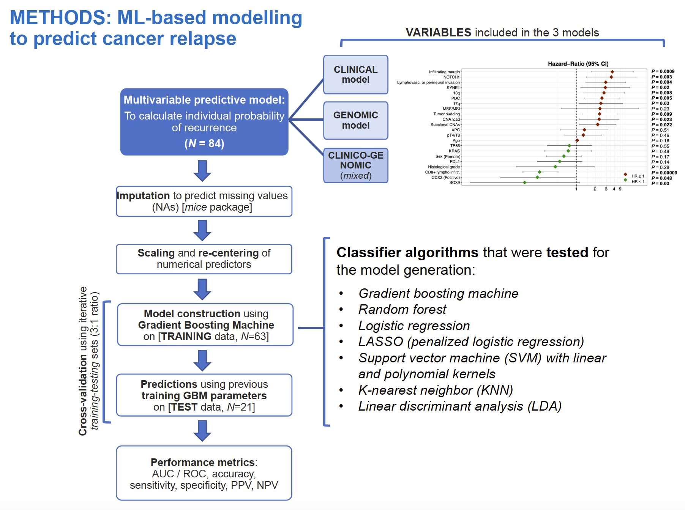

#####################################################################

# Title: MachineLearning_PredModels

Author: Sara Lahoz

Link: https://github.com/sr-lhz/MachineLearning_PredModels.git

Directory/Path: /sr-lhz/MachineLearning_PredModels

Description: Script(s) for visualizing sample-specific profiles of copy-number alterations (CNAs) -including chromosomal gains, losses, and events of loss-of-heterozygosity (LOH)- based on the log2-ratio & B-Allele Frequency (BAF) parameters as obtained from SNP-array or next-generation sequencing (NGS) data.

The steps included in each ML-based classifier model are (image below):
1. Imputation to predict missing values.
2. Scaling and re-centering of numerical predictors.
3. Model construction using a specific algorithm (i.e., gradient boosting machine, GBM; random forest; logistic regression; penalized logistic regression, LASSO; support vector machines, SVM; etc.)
4. Calculate predictions (i.e., probability of event per subject/case/row) based on previously trained model.
5. Cross-validation (in case a separate validstiono cohort is missing).
6. Evaluation of model performance (accuracy; sensitivity/specificity/precision/recall; area under the curve, AUC).

#####################################################################

